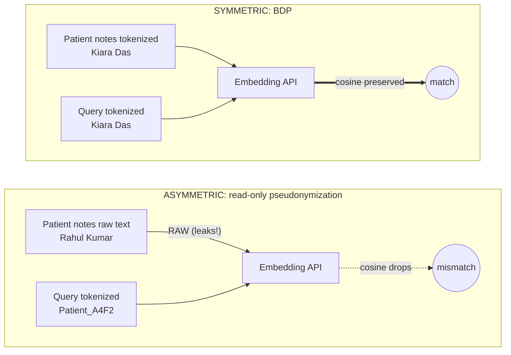
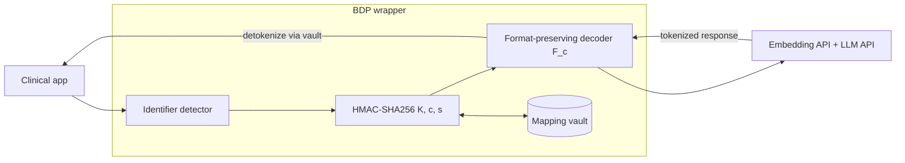

# Figure prompts

Prompts to hand to an image-generation AI (DALL-E 3, Midjourney, Imagen,
Gemini image gen, etc.) for each of the four figures referenced in
`main.tex`.

## Honest reality check before you spend tokens on AI images

| Fig | Best tool | Why |
|---|---|---|
| **Fig 1** — Asymmetry diagram | **tldraw / excalidraw / draw.io / Mermaid** (not AI image gen) | Technical diagrams with text labels. AI image gen will hallucinate the labels into gibberish. Use a real diagramming tool. AI prompt provided below as a fallback. |
| **Fig 2** — BDP architecture | **tldraw / excalidraw / draw.io / Mermaid** | Same as Fig 1. |
| **Fig 3** — Recall@k bar chart | **matplotlib** (already wired up; see `render_fig3.py`) | Quantitative chart. AI image gen will invent fake numbers. Use real data from `eval/results/results.json`. |
| **Fig 4** — End-to-end query trace | **Real terminal/SDK screenshot**, OR mockup in Figma | This is a screenshot of code/data flow. AI image gen will produce a code-shaped blob that looks real at thumbnail size but breaks on inspection. |

If you still want AI-generated images for any of these (e.g. for a blog
post or slide deck rather than the paper itself), use the prompts below.

---

## Figure 1 — Retrieval-asymmetry bug

**Caption in the paper:** *Asymmetric vs. symmetric write/read pipelines.
Top: write-time embeds raw text; read-time embeds tokenized text; cosine
similarity may fall. Bottom (BDP): both sides tokenized identically;
similarity preserved.*

**AI image prompt:**

> A clean, minimalist technical infographic split into two horizontal panels stacked vertically. The whole image has a white background, thin black/dark-blue line work, and a single accent color (teal or muted orange) for highlights. Typography is a clean sans-serif like Inter or IBM Plex Sans.
>
> Top panel labeled "ASYMMETRIC (read-only pseudonymization)":
>   - Left side: a stack of three rectangles labeled "Patient notes (raw text with names like Rahul Kumar)" with an arrow into a box labeled "Embedding API"; the arrow is colored RED to indicate the leak.
>   - Right side: a single rectangle labeled "User query (tokenized: Patient_A4F2)" with an arrow into the same "Embedding API" box.
>   - Below both, a vector-space cluster diagram with TWO non-overlapping clusters labeled "raw name embeddings" and "tokenized embeddings", with a dashed RED line between them labeled "cosine similarity falls".
>
> Bottom panel labeled "SYMMETRIC (BDP, this work)":
>   - Same layout as top, but BOTH the notes box AND the query box show "tokenized text" (e.g. "Kiara Das"), and the arrow into the Embedding API is GREEN, indicating no leak.
>   - The vector-space cluster diagram shows the two clusters OVERLAPPING with a solid GREEN line labeled "cosine similarity preserved".
>
> No photorealistic elements; vector/flat style. No human faces. No real logos. 16:9 aspect ratio. White background. Suitable for a serious academic paper.

**Better alternative (Mermaid, drops straight into the .tex via tikz/standalone):**



---

## Figure 2 — BDP architecture

**Caption in the paper:** *BDP architecture: HMAC-keyed deterministic
tokenization, format-preserving decoders, mapping vault, and the symmetric
ingest/query wrappers around the embedding and LLM APIs.*

**AI image prompt:**

> A clean, minimalist system-architecture diagram on a white background, thin dark-blue line work, single teal accent color, sans-serif labels.
>
> Left to right:
>   1. A box labeled "Clinical app (controller)".
>   2. An arrow into a vertical stack of three boxes inside a dotted border labeled "BDP wrapper". The three boxes top-to-bottom: "Identifier detector (Presidio + Indian recognizers)", "HMAC-SHA256(tenant key, category || value)", "Format-preserving decoder F_c (name -> name, date -> date, phone -> phone)".
>   3. A side-arrow from "HMAC..." into a small cylinder labeled "Mapping vault" (controller-side).
>   4. An arrow out of the wrapper into a box labeled "Embedding API + LLM API (external)".
>   5. A return arrow labeled "tokenized response" back through the BDP wrapper (showing detokenization at the controller boundary using the vault).
>
> The "Mapping vault" cylinder is inside a shaded box labeled "Trusted zone (controller-operated)". Everything to the right of "Embedding API + LLM API" is in a different shaded box labeled "External processor".
>
> No real logos. No photorealistic elements. Vector/flat style. 16:9 aspect ratio. White background. Suitable for a serious academic paper.

**Better alternative (Mermaid):**



---

## Figure 3 — Recall@k bar chart

**Don't use AI image gen for this one — it'll invent the numbers.** Run:

```powershell
cd D:\Projects\brane-mvp\paper\figures
python render_fig3.py
```

That reads `../eval/results/results.json` and writes `fig3_recall.pdf` next
to this file. matplotlib will produce a clean grouped bar chart with the
exact recall@k numbers from your last eval run.

If you absolutely must have an AI-generated version (e.g. for a hero
graphic), the prompt is:

> A clean academic-style grouped bar chart on white background, no 3D effects. Four pipeline names on the x-axis in this order: "Raw", "Redaction", "Read-only", "BDP". For each pipeline, three vertically-stacked-side-by-side bars representing R@1, R@5, R@10. Y-axis labeled "Recall@k" from 0 to 1.0. Use a colorblind-friendly palette: BDP in a distinct color (teal), the other three in muted grays. Legend in top-right. Title: "Retrieval recall across pipelines (bootstrap, n=100)". Sans-serif typography (Inter or similar). Vector style. Suitable for a serious academic paper.
>
> **Important: do not invent the numbers. Leave the y-values as a generic illustrative range and I will overlay real values manually. OR use these exact values: Raw R@1=0.054, R@5=0.430, R@10=0.616. Redaction R@1=0.002, R@5=0.018, R@10=0.060. Read-only R@1=0.001, R@5=0.021, R@10=0.046. BDP R@1=0.053, R@5=0.320, R@10=0.539.**

---

## Figure 4 — End-to-end BDP query trace

**Caption in the paper:** *End-to-end trace of one query under BDP:
original question, tokenized query sent to the embedding API, retrieved
chunks (also tokenized), LLM response, and detokenized final answer
rendered to the clinician.*

**Best:** take a real screenshot of the trace from the eval harness. The
quickest way to get one:

```powershell
cd D:\Projects\brane-mvp\paper\eval
python -c "
from clinical_accuracy import GeminiBackend, GEN_SYSTEM, GEN_USER_TEMPLATE
from bdp import LookupDetector, detokenize_text
from pipelines import BDPPipeline, IndexedNote
from run import load_corpus

_, notes, queries, roster = load_corpus()
notes_by_id = {n['note_id']: n for n in notes}
detector = LookupDetector([(c,v) for c,v in roster])

pipe = BDPPipeline(detector)
pipe.index([IndexedNote(note_id=n['note_id'], text=n['text']) for n in notes])

q = next(q for q in queries if q['category']=='lookup')
print('=== 1. ORIGINAL QUESTION ===')
print(q['text'])
print()
print('=== 2. TOKENIZED QUERY (what the embedder sees) ===')
print(pipe.phi_r(q['text']))
print()
ids = pipe.query(q['text'], k=3)
print('=== 3. RETRIEVED CHUNKS (top-3, tokenized) ===')
for rid in ids:
    print(pipe.phi_w(notes_by_id[rid]['text'])[:300]); print('---')
b = GeminiBackend()
chunks = '\n\n---\n\n'.join(pipe.phi_w(notes_by_id[r]['text']) for r in ids if r in notes_by_id)
ans = b.chat(GEN_SYSTEM, GEN_USER_TEMPLATE.format(query=pipe.phi_r(q['text']), k=3, chunks=chunks))
print('=== 4. LLM RESPONSE (still tokenized) ===')
print(ans)
print()
print('=== 5. DETOKENIZED FINAL ANSWER (what the clinician sees) ===')
print(detokenize_text(ans, pipe.vault))
"
```

Pipe that into a screenshot tool (Carbon, ray.so, or just a clean
Windows Terminal screenshot). Drop the resulting PNG into this directory
as `fig4_trace.png`.

**AI image prompt (if you can't take a screenshot):**

> A code-editor screenshot mockup on a dark background (VS Code "One Dark Pro" theme), monospace font (JetBrains Mono or Fira Code), showing FIVE clearly-labeled sections stacked vertically:
>   1. "ORIGINAL QUESTION" — a single line: `What was Rahul Kumar's most recent HbA1c value?`
>   2. "TOKENIZED QUERY" — a single line: `What was Kiara Das's most recent HbA1c value?`
>   3. "RETRIEVED CHUNKS (top-3, tokenized)" — three short clinical-note snippets each starting with "Patient: Kiara Das, MRN MRN-..., ABHA ..., Visit 2024-XX-XX, HbA1c X.X%"
>   4. "LLM RESPONSE (tokenized)" — `Kiara Das's most recent HbA1c value was 8.2%.`
>   5. "DETOKENIZED FINAL ANSWER (what the clinician sees)" — `Rahul Kumar's most recent HbA1c value was 8.2%.`
>
> Each section is preceded by a comment line `# === N. SECTION NAME ===` in a dim color. Syntax-highlighting style. 16:9 aspect ratio. No window chrome. Clean and readable. Suitable for a serious academic paper.

---

## After you have the four images

Save them in this directory with these exact names:
- `fig1_asymmetry.pdf` (or `.png`)
- `fig2_architecture.pdf`
- `fig3_recall.pdf` (auto-generated by `render_fig3.py`)
- `fig4_trace.png`

Then in `paper/main.tex`, find each of the four `\fbox{\parbox{...}{...}}`
blocks and replace with:

```latex
\includegraphics[width=0.9\linewidth]{figures/figN_NAME.pdf}
```

Keep the surrounding `\begin{figure}[t] ... \caption{...} \label{...} \end{figure}`
exactly as it is.
